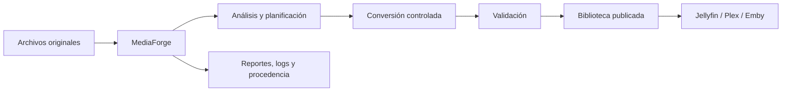
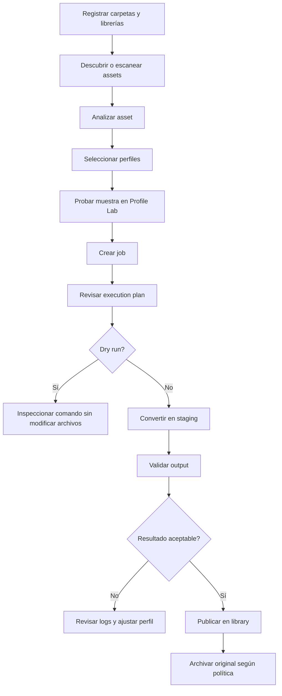

# MediaForge

MediaForge es una plataforma self-hosted para analizar, preparar, convertir, validar y publicar archivos multimedia antes de incorporarlos a Jellyfin, Plex, Emby u otra biblioteca.

No es un servidor multimedia ni reemplaza a Jellyfin. MediaForge es la capa de procesamiento entre los archivos originales y la biblioteca final.



## Funciones principales

- Inventario y análisis técnico mediante FFprobe.
- Perfiles reproducibles de video, audio y selección de tracks.
- Profile Lab para probar muestras antes de procesar archivos completos.
- Cola, planificación, límites de recursos y horarios de trabajo.
- Ejecución FFmpeg con dry run y revisión previa.
- Validación antes de publicar.
- Archivo de originales y reportes persistentes.
- Recuperación del scheduler después de reinicios.
- Instalación Docker versionada para PC, laptop, HomeLab y NAS.

## Flujo de trabajo



## Instalación en PC o laptop

### Requisitos

- Docker Desktop en macOS o Windows, o Docker Engine con Compose v2 en Linux.
- Una versión publicada de MediaForge.
- Carpetas dedicadas para configuración, originales, staging, biblioteca, archivo y reportes.

### Instalación recomendada

1. Descarga del [release más reciente](https://github.com/xxmenioxx/mediaforge/releases) estos archivos:

   - `mediaforge-compose.yml`
   - `mediaforge.env.example`
   - `mediaforge-backup.sh`

2. Colócalos en una carpeta dedicada y renombra los dos primeros:

```sh
mkdir -p mediaforge
cd mediaforge
mv mediaforge-compose.yml compose.yml
mv mediaforge.env.example .env
chmod +x mediaforge-backup.sh
```

3. Crea las carpetas de datos. En macOS o Linux, por ejemplo:

```sh
mkdir -p data/config data/raw data/library data/staging data/originals_archive data/reports
```

4. Edita `.env` y utiliza paths absolutos. Ejemplo para macOS o Linux:

```dotenv
MEDIAFORGE_VERSION=0.1.0
MEDIAFORGE_PORT=8090
TZ=America/Mexico_City

CONFIG_PATH=/ruta/absoluta/mediaforge/data/config
RAW_PATH=/ruta/absoluta/mediaforge/data/raw
LIBRARY_PATH=/ruta/absoluta/mediaforge/data/library
STAGING_PATH=/ruta/absoluta/mediaforge/data/staging
ARCHIVE_PATH=/ruta/absoluta/mediaforge/data/originals_archive
REPORTS_PATH=/ruta/absoluta/mediaforge/data/reports
```

5. Inicia MediaForge:

```sh
docker compose --env-file .env -f compose.yml pull
docker compose --env-file .env -f compose.yml up -d
docker compose --env-file .env -f compose.yml ps
```

6. Abre [http://localhost:8090](http://localhost:8090).

En Windows, configura los paths desde Docker Desktop y usa rutas absolutas accesibles para Docker. WSL2 es la opción recomendada para ejecutar los comandos de shell y el script de backup.

## Instalación en HomeLab, servidor Docker o NAS

El mismo paquete funciona en equipos `linux/amd64` y `linux/arm64`.

La instalación independiente recomendada vive, como otras aplicaciones Docker, en un directorio propio:

```text
/volume1/docker/mediaforge
```

En un NAS con NVMe en `volume1` y HDD en `volume2`, utiliza el NVMe para inputs activos y staging, y el HDD para bibliotecas y archivo de originales:

```sh
mkdir -p /volume1/docker/mediaforge/config
mkdir -p /volume1/docker/mediaforge/data/raw
mkdir -p /volume1/docker/mediaforge/data/staging
mkdir -p /volume1/docker/mediaforge/reports
mkdir -p /volume2/media/mediaforge/originals_archive
```

En `.env`, `LIBRARY_PATH` apunta a `/volume2/media` y `ARCHIVE_PATH` a `/volume2/media/mediaforge/originals_archive`. Todos estos paths siguen siendo configurables para otros NAS.

Configura esos paths en `.env` y ejecuta:

```sh
docker compose --env-file .env -f compose.yml pull
docker compose --env-file .env -f compose.yml up -d
docker compose --env-file .env -f compose.yml ps
```

Accede mediante `http://IP-DEL-SERVIDOR:8090`. No expongas MediaForge directamente a Internet; para acceso remoto utiliza una VPN o un reverse proxy con autenticación y TLS.

La instalación estándar no depende de ningún stack externo. Para este HomeLab existe además una [integración opcional con nas-media-stack](docs/guides/nas-media-stack-integration.md). Consulta la [guía completa de instalación Docker y NAS](docs/docker-nas-installation.md) para backups, actualizaciones, rollback e imágenes privadas.

## Primera ejecución segura

Antes de procesar una colección:

1. Mantén `dryRunOnly` activado.
2. Usa un worker y un job simultáneo.
3. Mantén validación y publicación automáticas desactivadas.
4. Prueba con un archivo pequeño y descartable.
5. Revisa el execution plan y el comando generado.
6. Activa conversión real sólo después de validar los mounts y FFmpeg.
7. Conserva originales y reportes durante el piloto.

## Actualizar y respaldar

Antes de actualizar, confirma que no haya jobs ejecutándose y crea un backup consistente de SQLite:

```sh
./mediaforge-backup.sh
```

Cambia `MEDIAFORGE_VERSION` en `.env` y ejecuta:

```sh
docker compose --env-file .env -f compose.yml pull
docker compose --env-file .env -f compose.yml up -d
```

Nunca dependas de `latest` para una instalación estable.

## Desarrollo local

El entorno de desarrollo usa Vite y el backend Go directamente desde sus Dockerfiles:

```sh
git clone https://github.com/xxmenioxx/mediaforge.git
cd mediaforge
docker compose up --build
```

- UI: [http://localhost:5173](http://localhost:5173)
- API: [http://localhost:8080](http://localhost:8080)
- Swagger: [http://localhost:8080/swagger/index.html](http://localhost:8080/swagger/index.html)

Validaciones principales:

```sh
cd backend && go test ./...
cd ../frontend && npm ci && npm run build
```

## Documentación

Empieza por el [índice de documentación](docs/README.md):

- [Cómo usar MediaForge](docs/guides/using-mediaforge.md)
- [Perfiles de video, audio y tracks](docs/guides/profiles.md)
- [Cómo funciona el scheduler](docs/guides/scheduler.md)
- [Cómo configurar releases en GitHub y GHCR](docs/guides/github-releases.md)
- [Integración con nas-media-stack](docs/guides/nas-media-stack-integration.md)
- [Checklist de validación del scheduler](docs/scheduler-v1-validation.md)
- [Próximos pasos y roadmap](docs/roadmap/README.md)

## Estado del proyecto

MediaForge está en desarrollo activo. La versión `0.1.x` debe tratarse como un piloto controlado: conserva backups, procesa primero copias o archivos descartables y revisa manualmente los resultados antes de automatizar la publicación de una colección completa.

## Licencia

El repositorio aún debe declarar explícitamente su archivo de licencia antes de una distribución pública estable.
