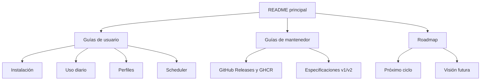

# Documentación de MediaForge

Este directorio separa las guías operativas, las especificaciones técnicas y el trabajo futuro.

## Para usuarios

1. [Instalación Docker en NAS, HomeLab o servidor](docker-nas-installation.md)
2. [Integración con nas-media-stack](guides/nas-media-stack-integration.md)
3. [Cómo usar MediaForge](guides/using-mediaforge.md)
4. [Perfiles de video, audio y tracks](guides/profiles.md)
5. [Cómo funciona el scheduler](guides/scheduler.md)
6. [Checklist de validación del scheduler](scheduler-v1-validation.md)

## Para mantenedores

- [Releases con GitHub Actions y GHCR](guides/github-releases.md)
- [Guía técnica completa del Scheduler v1](scheduler-v1-guide.md)
- [Contexto general del proyecto](context.md)
- [Visión de producto](vision.md)
- [Visión V2](v2_mediaforge.md)
- [Discovery & Analysis V2](v2-discovery-analysis.md)

## Próximos pasos

- [Roadmap e índice](roadmap/README.md)
- [Siguiente ciclo de trabajo](roadmap/next-steps.md)

## Mapa documental

Los documentos bajo `guides/` describen el comportamiento disponible. Los documentos de visión y `roadmap/` pueden incluir funciones todavía no implementadas; cada propuesta debe indicarlo de forma explícita.
