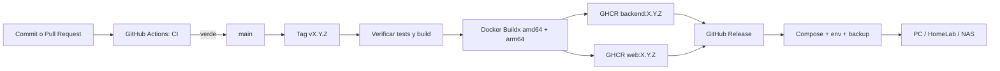
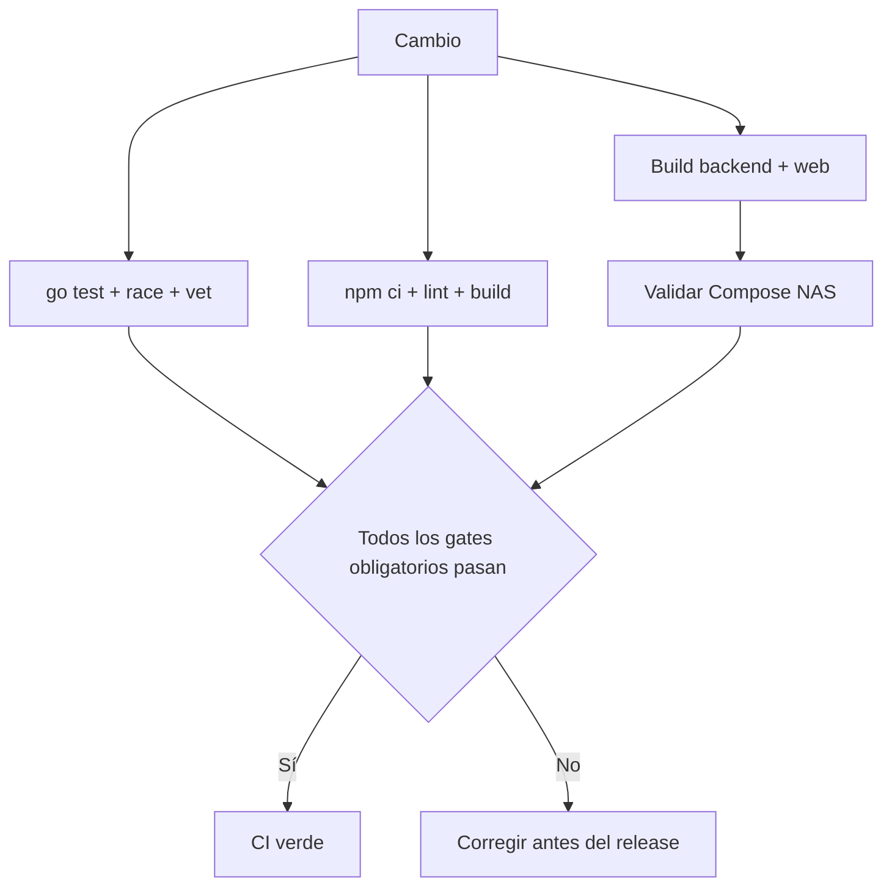

# Releases de MediaForge con GitHub Actions y GHCR

Esta guía reproduce la configuración usada para publicar versiones instalables de MediaForge sin mantener un registry propio.

## Arquitectura de publicación



## Componentes del repositorio

MediaForge utiliza:

- `.github/workflows/ci.yml` para validar cambios en pull requests y `main`.
- `.github/workflows/release-images.yml` para publicar tags `v*.*.*`.
- `backend/Dockerfile` para la API, FFmpeg y SQLite.
- `frontend/Dockerfile` para compilar React y servirlo con Nginx.
- `deploy/nas/compose.yml` como instalador distribuible.
- `deploy/nas/.env.example` como contrato de configuración.
- `deploy/nas/backup.sh` para backups consistentes de SQLite.

## Configuración inicial de GitHub

### Actions

En el repositorio abre **Settings → Actions → General** y confirma que GitHub Actions está habilitado. Los workflows declaran permisos mínimos dentro del YAML:

```yaml
permissions:
  contents: write
  packages: write
```

`contents: write` permite crear el GitHub Release. `packages: write` permite publicar en GHCR. El workflow utiliza `secrets.GITHUB_TOKEN`; no se necesita almacenar un token personal para publicar desde el mismo repositorio.

### Container Registry

Las imágenes publicadas son:

```text
ghcr.io/xxmenioxx/mediaforge-backend:X.Y.Z
ghcr.io/xxmenioxx/mediaforge-web:X.Y.Z
```

Después de la primera publicación, abre cada package y comprueba:

1. **Package settings**.
2. El repositorio `xxmenioxx/mediaforge` aparece bajo acceso de Actions.
3. La visibilidad es la deseada.

Un package público se puede descargar sin `docker login`. GitHub advierte que un package público no puede volver a hacerse privado; decide esto antes de distribuirlo.

Si los packages permanecen privados, el equipo destino debe autenticarse con un token que tenga `read:packages`:

```sh
printf '%s' "$GHCR_TOKEN" | docker login ghcr.io -u xxmenioxx --password-stdin
```

## Flujo de CI

En cada pull request o push a `main`, `ci.yml` ejecuta:



El lint del frontend está temporalmente marcado como informativo mientras se corrige la línea base existente. El build TypeScript continúa siendo obligatorio.

## Crear una versión

Usa Semantic Versioning:

- `PATCH`: corrección compatible, por ejemplo `0.1.1`.
- `MINOR`: funcionalidad compatible, por ejemplo `0.2.0`.
- `MAJOR`: cambio incompatible, por ejemplo `1.0.0`.

Antes del tag:

```sh
git switch main
git pull --ff-only
git status
```

El árbol debe estar limpio y la CI de `main` debe estar verde. Crea un tag anotado:

```sh
git tag -a v0.1.0 -m "MediaForge v0.1.0"
git push origin v0.1.0
```

No reutilices ni muevas un tag que ya fue publicado. Si un release tiene un defecto, corrígelo y publica un nuevo patch.

## Qué genera el workflow

Para `v0.1.0`:

```text
ghcr.io/xxmenioxx/mediaforge-backend:0.1.0
ghcr.io/xxmenioxx/mediaforge-backend:0.1
ghcr.io/xxmenioxx/mediaforge-web:0.1.0
ghcr.io/xxmenioxx/mediaforge-web:0.1
```

También genera tags por SHA y construye manifests para `linux/amd64` y `linux/arm64`.

El GitHub Release adjunta:

```text
mediaforge-compose.yml
mediaforge.env.example
mediaforge-backup.sh
```

El workflow sustituye automáticamente `MEDIAFORGE_VERSION` en el `.env` adjunto por la versión publicada.

## Validación posterior

1. Confirma que los jobs `verify`, `publish` y `release` estén verdes.
2. Confirma que ambos packages muestren la nueva versión.
3. Descarga los tres assets del release.
4. En una máquina limpia, ejecuta `docker compose pull`.
5. Verifica `/health`, UI, API y backup.
6. Despliega en el NAS de prueba.

## Rollback de una aplicación instalada

No muevas tags de imágenes. Cambia la versión en `.env`:

```dotenv
MEDIAFORGE_VERSION=0.1.0
```

Después:

```sh
docker compose --env-file .env -f compose.yml pull
docker compose --env-file .env -f compose.yml up -d
```

Si la versión nueva migró SQLite de forma incompatible, restaura también el backup anterior con el backend detenido.

## Problemas frecuentes

### `manifest unknown`

- Confirma que el tag de `.env` exista en ambos packages.
- Comprueba que el workflow de publicación terminó.
- Evita anteponer `v` en `MEDIAFORGE_VERSION`; la imagen usa `0.1.0`, no `v0.1.0`.

### `denied` o `unauthorized`

- El package es privado y Docker no está autenticado.
- El token no tiene `read:packages`.
- El package no está conectado al repositorio que ejecuta Actions.

### Un job de una arquitectura falla

- Revisa el build de Buildx/QEMU.
- Comprueba que las imágenes base soporten la arquitectura.
- No publiques el release como estable si falta una arquitectura anunciada.

## Referencias oficiales

- [Publicar imágenes Docker con GitHub Actions](https://docs.github.com/en/actions/tutorials/publish-packages/publish-docker-images)
- [Trabajar con GitHub Container Registry](https://docs.github.com/en/packages/working-with-a-github-packages-registry/working-with-the-container-registry)
- [Configurar visibilidad y acceso de packages](https://docs.github.com/en/packages/learn-github-packages/configuring-a-packages-access-control-and-visibility)
