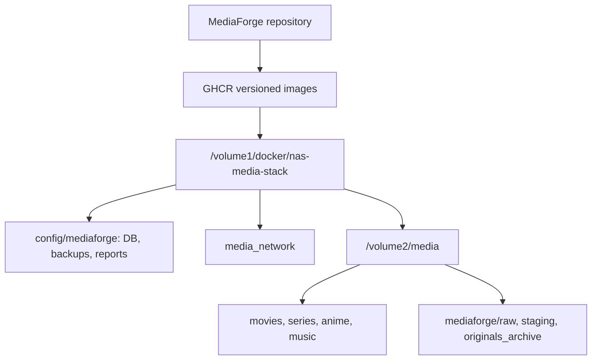

# Integración opcional de MediaForge con nas-media-stack

El HomeLab tiene dos repositorios con responsabilidades distintas:

- **MediaForge**: código, tests, Dockerfiles, imágenes GHCR y releases.
- **nas-media-stack**: fuente de verdad del despliegue real del NAS, servicios, red, puertos, variables y backups.

Esta integración es específica del HomeLab y no forma parte de los requisitos de instalación estándar. MediaForge continúa siendo instalable de manera independiente en `/volume1/docker/mediaforge`.

Si se elige este modo, `nas-media-stack` administra el servicio y no debe levantarse simultáneamente otra instancia desde `/volume1/docker/mediaforge` usando el mismo puerto o las mismas carpetas.

## Layout oficial

```text
/volume1/docker/nas-media-stack/
  compose.yaml
  compose/
  config/
    mediaforge/
      mediaforge.db
      backups/
      reports/

/volume2/media/
  movies/
  anime-movies/
  series/
  anime/
  music/
  downloads/
  mediaforge/
    raw/
    staging/
    originals_archive/
```



## Distribución de datos

| Rol | Host path | Container path | Backup |
|---|---|---|---|
| SQLite/config | `${CONFIG_ROOT}/mediaforge` | `/app/data` | Sí |
| Reports | `${CONFIG_ROOT}/mediaforge/reports` | `/media/reports` | Sí |
| Raw controlado | `${MEDIA_ROOT}/mediaforge/raw` | `/media/raw` | Según política de medios |
| Movies | `${MEDIA_ROOT}/movies` | `/media/library/movies` | No en backup del stack |
| Anime movies | `${MEDIA_ROOT}/anime-movies` | `/media/library/anime-movies` | No en backup del stack |
| Series | `${MEDIA_ROOT}/series` | `/media/library/series` | No en backup del stack |
| Anime | `${MEDIA_ROOT}/anime` | `/media/library/anime` | No en backup del stack |
| Music | `${MEDIA_ROOT}/music` | `/media/library/music` | No en backup del stack |
| Staging | `${MEDIA_ROOT}/mediaforge/staging` | `/media/staging` | No; es reconstruible |
| Originales archivados | `${MEDIA_ROOT}/mediaforge/originals_archive` | `/media/originals_archive` | Según política de medios |

`CONFIG_ROOT` actualmente es `/volume1/docker/nas-media-stack/config` y `MEDIA_ROOT` es `/volume2/media`.

## Módulo Compose propuesto

En `nas-media-stack`, MediaForge debe vivir en `compose/mediaforge.yaml`:

```yaml
services:
  mediaforge-backend:
    image: ghcr.io/xxmenioxx/mediaforge-backend:${MEDIAFORGE_VERSION}
    container_name: mediaforge-backend
    environment:
      MEDIAFORGE_API_HOST: 0.0.0.0
      MEDIAFORGE_API_PORT: 8080
      MEDIAFORGE_DB_PATH: /app/data/mediaforge.db
      TZ: ${TZ}
    volumes:
      - ${CONFIG_ROOT}/mediaforge:/app/data
      - ${MEDIA_ROOT}/mediaforge/raw:/media/raw
      - ${MEDIA_ROOT}/movies:/media/library/movies
      - ${MEDIA_ROOT}/anime-movies:/media/library/anime-movies
      - ${MEDIA_ROOT}/series:/media/library/series
      - ${MEDIA_ROOT}/anime:/media/library/anime
      - ${MEDIA_ROOT}/music:/media/library/music
      - ${MEDIA_ROOT}/mediaforge/staging:/media/staging
      - ${MEDIA_ROOT}/mediaforge/originals_archive:/media/originals_archive
      - ${CONFIG_ROOT}/mediaforge/reports:/media/reports
    networks:
      media_network:
        aliases:
          - backend
    restart: unless-stopped
    healthcheck:
      test: ["CMD", "wget", "-qO-", "http://127.0.0.1:8080/health"]
      interval: 30s
      timeout: 5s
      start_period: 15s
      retries: 3

  mediaforge:
    image: ghcr.io/xxmenioxx/mediaforge-web:${MEDIAFORGE_VERSION}
    container_name: mediaforge
    ports:
      - "${MEDIAFORGE_PORT}:80"
    depends_on:
      mediaforge-backend:
        condition: service_healthy
    networks:
      - media_network
    restart: unless-stopped
```

El alias `backend` es necesario porque el Nginx incluido en la imagen web utiliza ese hostname para el proxy interno.

## Cambios en nas-media-stack

1. Copiar el módulo a `compose/mediaforge.yaml`.
2. Añadirlo a los `include` de `compose.yaml`.
3. Añadir a `.env.example`:

```dotenv
MEDIAFORGE_VERSION=0.1.0
MEDIAFORGE_PORT=8090
```

4. Crear carpetas:

```sh
mkdir -p /volume1/docker/nas-media-stack/config/mediaforge/reports
mkdir -p /volume2/media/mediaforge/raw
mkdir -p /volume2/media/mediaforge/staging
mkdir -p /volume2/media/mediaforge/originals_archive
```

5. Validar desde `/volume1/docker/nas-media-stack`:

```sh
docker compose --env-file .env config
docker compose --env-file .env pull
docker compose --env-file .env up -d
docker compose --env-file .env ps
```

## Backups

El script de backup de `nas-media-stack` ya protege `/volume1/docker/nas-media-stack`. Al guardar SQLite, backups y reports bajo `${CONFIG_ROOT}/mediaforge`, pasan a formar parte del backup del stack.

Antes de actualizar MediaForge, crea además un backup consistente con SQLite `.backup`; copiar el directorio mientras la base está escribiendo no sustituye ese paso.

Los archivos bajo `/volume2/media` se excluyen deliberadamente del backup del stack y requieren su propia política de protección.

## Red y futuras integraciones

MediaForge puede pertenecer a `media_network`, pero no necesita acceso directo a Radarr, Sonarr, Bazarr o Jellyfin para su flujo v1. Cualquier integración futura debe usar Docker DNS y credenciales dedicadas; no debe asumir acceso administrativo sólo por compartir red.

## Actualizaciones

La imagen se publica desde el repositorio MediaForge. El despliegue se actualiza desde `nas-media-stack`:


No uses `latest`; actualiza `MEDIAFORGE_VERSION` mediante un cambio revisado en `nas-media-stack`.
