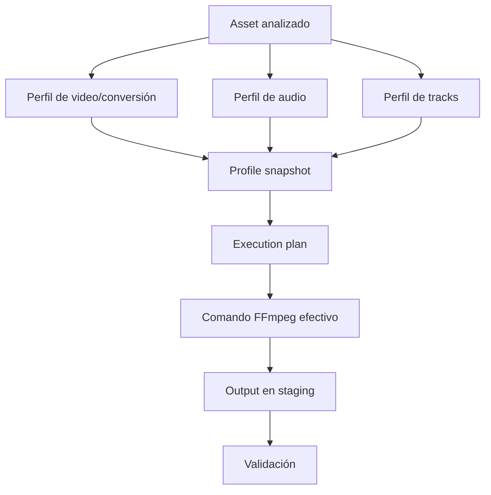
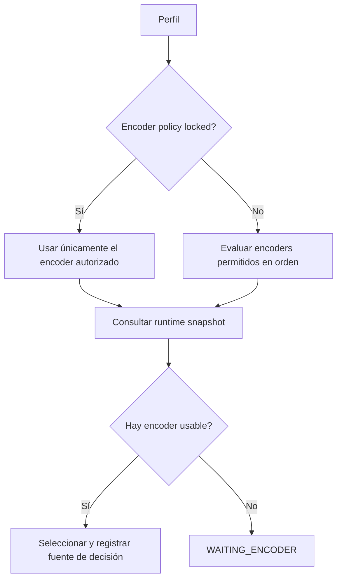
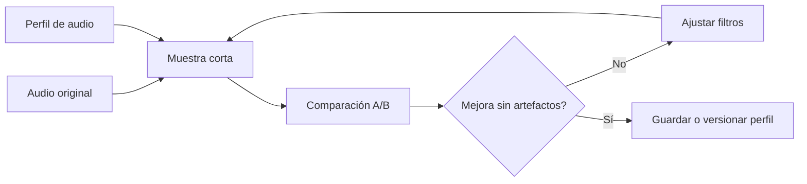

# Perfiles de video, audio y tracks

Los perfiles son contratos reproducibles. Definen cómo debe procesarse un asset y permiten explicar posteriormente por qué un output tiene determinados codecs, filtros y streams.

## Relación entre perfiles



Un snapshot conserva la configuración efectiva cuando se crea el job. Cambiar el perfil original después no debe alterar silenciosamente un job ya planificado.

## Perfil de video o conversión

Se administra en **Profiles**. Define principalmente:

- Container de salida.
- Familia de codec.
- Encoder preferido y encoders permitidos.
- Política de fallback.
- Pixel format y bit depth.
- Estrategia y valor de calidad.
- Preset y argumentos adicionales controlados.
- Política de audio original, subtítulos, capítulos y metadata.

### Flujo recomendado

1. Empieza con un preset cercano al objetivo.
2. Duplica el preset; no conviertas un perfil general en un caso especial.
3. Escribe un nombre que incluya propósito, codec y compromiso principal.
4. Mantén el encoder coherente con el codec y el pixel format.
5. Prueba una muestra en Profile Lab.
6. Revisa el comando efectivo.
7. Valida tamaño, calidad visual y compatibilidad.
8. Activa el perfil para jobs reales.

Ejemplos de nombres útiles:

```text
DVD Archive x265 Main10
Anime Grain x265 Main10
Series Balanced x265 Main10
Apple TV HEVC Hardware
```

### Encoder policy



No declares un fallback que cambie silenciosamente la naturaleza del perfil. Por ejemplo, un perfil diseñado y validado para hardware no debería caer a software sin que esa política sea explícita.

### Calidad

- **CRF/quality-based**: busca una calidad relativa; el tamaño varía con el contenido.
- **Bitrate-based**: controla mejor el bitrate, necesario para algunos encoders hardware.
- **Preset**: normalmente intercambia velocidad por eficiencia, no es una escala directa de calidad.

No compares números de calidad entre encoders como si fueran equivalentes. Valida cada combinación con muestras representativas.

## Perfil de audio

Se administra en **Audio**. Puede describir:

- Codec de salida.
- Preservación de la pista original.
- Loudness objetivo y true peak.
- Claridad de diálogo.
- Limpieza de fuentes antiguas.
- EQ por bandas.
- Tratamiento mono, dual mono o estéreo.
- Cadena avanzada de filtros FFmpeg.

### Método seguro



Recomendaciones:

- Preserva la pista original durante el piloto.
- Cambia una dimensión a la vez.
- Usa diálogo, música, silencios y escenas ruidosas en la comparación.
- Evita normalización agresiva sin revisar true peak.
- Considera restauración y conversión como decisiones separadas.
- Usa filtros experimentales sólo en copias y con revisión auditiva.

## Perfil de tracks

Se administra en **Track Profiles** y controla la selección de streams:

- Índices explícitos de video, audio y subtítulos.
- Regla de audio: `all`, `default`, `languages` o `none`.
- Regla de subtítulos: `all`, `none`, `forced`, `languages` o `forced-or-languages`.
- Idiomas de audio y subtítulos.
- Política de validación: `block`, `review` o `warn`.
- Notas para explicar la intención.

### Ejemplo conceptual

```text
Nombre: Spanish + Original Audio
Audio rule: languages
Audio languages: spa, eng, jpn
Subtitle rule: forced-or-languages
Subtitle languages: spa
Validation: review
```

Los códigos de idioma de archivos reales no siempre son consistentes. Analiza el asset antes de asumir que `spa`, `es` o una etiqueta textual significan lo mismo.

### Política de validación

| Valor | Uso recomendado |
|---|---|
| `block` | Perder el stream sería inaceptable |
| `review` | Se necesita confirmación humana |
| `warn` | El job puede continuar dejando evidencia |

## Cómo combinarlos

Para un DVD de anime, por ejemplo:

```text
Video: Anime DVD x265 Main10
Audio: Gentle normalization, preservando original
Tracks: japonés + español, subtítulos españoles y forced
```

La combinación debe probarse junta: una muestra de video aislada no demuestra que el mapping de audio y subtítulos sea correcto.

## Versionado y cambios

- Duplica un perfil estable antes de hacer cambios grandes.
- Incluye el propósito en el nombre, no sólo parámetros técnicos.
- Documenta por qué se creó y con qué fuentes fue validado.
- Conserva perfiles históricos mientras existan jobs que los referencien.
- Deshabilita antes de eliminar.
- Exporta perfiles importantes como respaldo o para revisión.

## Checklist antes de habilitar un perfil

- [ ] El container es compatible con los streams elegidos.
- [ ] Codec, encoder, bit depth y pixel format son coherentes.
- [ ] El runtime objetivo declara el encoder como usable.
- [ ] La muestra visual o auditiva fue revisada.
- [ ] El tamaño estimado es razonable.
- [ ] Audio original, subtítulos y capítulos se conservan según intención.
- [ ] Las reglas de tracks no eliminan idiomas necesarios.
- [ ] El comando dry run fue inspeccionado.
- [ ] Un output real pequeño pasó Validation.
