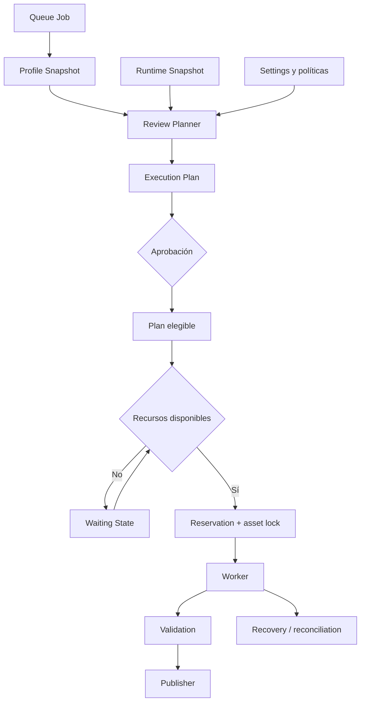
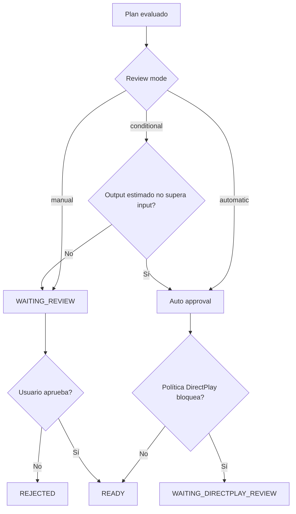
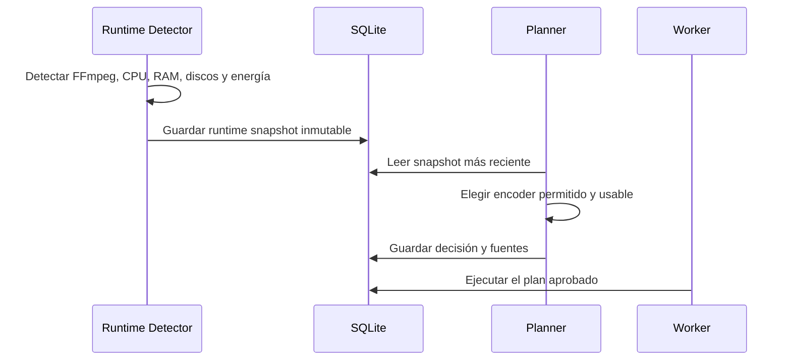
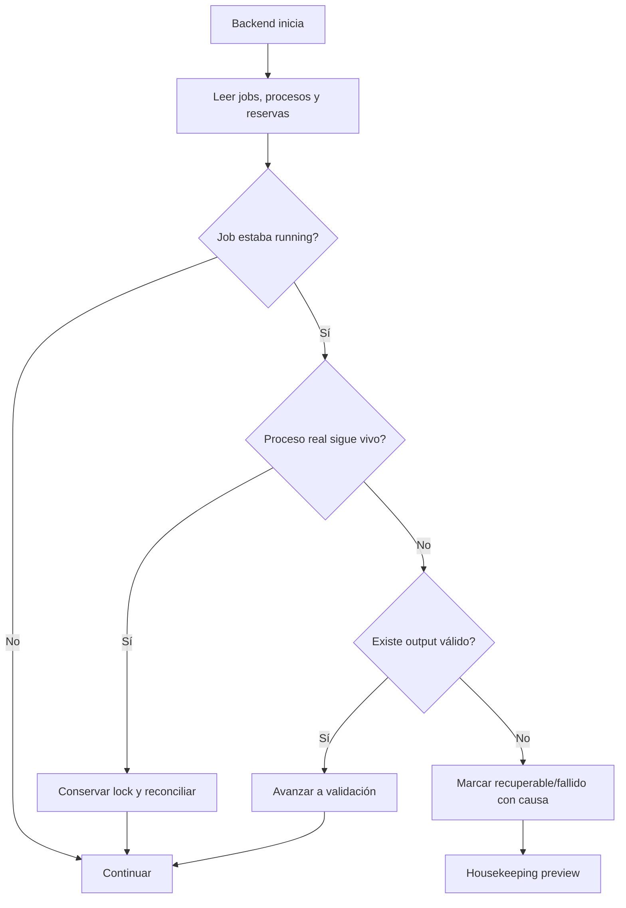

# Cómo funciona el scheduler

El scheduler convierte la intención de un job en una ejecución controlada. Decide qué puede ejecutarse, dónde, con qué encoder y bajo qué límites, conservando evidencia de cada decisión.

Para la referencia completa de settings, estados y modelos consulta [MediaForge Scheduler v1](../scheduler-v1-guide.md).

## Componentes



## Del job al plan

1. Queue crea un job.
2. Se captura la versión efectiva del perfil.
3. Planner crea un execution plan.
4. El plan combina perfil, runtime snapshot, librería y políticas.
5. Se elige encoder y output esperado.
6. Se estiman output y workspace.
7. Se evalúan DirectPlay, horarios y recursos.
8. El plan queda listo, pendiente de revisión o esperando una condición.

## Review modes



Una aprobación no garantiza ejecución inmediata. El plan todavía debe satisfacer horarios, workspace y recursos.

## Estados de espera

| Estado | Significado | Acción habitual |
|---|---|---|
| `WAITING_REVIEW` | Falta aprobación humana | Revisar y aprobar/rechazar |
| `WAITING_DIRECTPLAY_REVIEW` | Riesgo de compatibilidad | Revisar clientes y streams |
| `WAITING_ENCODER` | Ningún encoder permitido está usable | Revisar snapshot y perfil |
| `WAITING_SCHEDULE_WINDOW` | Fuera de horario permitido | Esperar o modificar ventana |
| `WAITING_RAM` | Memoria disponible insuficiente | Liberar carga o ajustar límite |
| `WAITING_SSD_SPACE` | Workspace sin espacio suficiente | Limpiar o cambiar estrategia |
| `WAITING_HDD_SPACE` | Destino sin espacio suficiente | Liberar espacio |
| `WAITING_PROFILE_LIMIT` | Límite de esa clase de job | Esperar otro job |
| `WAITING_WORKER` | No hay worker elegible | Revisar worker registry/estado |
| `WAITING_POWER` | Política de batería activa | Conectar energía o cambiar política |

Los estados de espera son condiciones recuperables. El planner vuelve a evaluarlos cuando cambia el entorno.

## Runtime snapshot y encoder

El runtime detector registra CPU, memoria, discos, energía y capacidades de encoders. El planner usa ese snapshot persistido para que una decisión siga siendo explicable aunque el host cambie después.



Un worker online también declara encoders y concurrencia. El perfil autoriza; el snapshot demuestra capacidad; el scheduler reserva; el worker ejecuta.

## Reservas y locks

Antes de ejecutar, MediaForge reserva:

- Job y asset.
- Encoder y clase de encoder.
- Memoria estimada.
- Espacio de workspace y library.
- Slot de concurrencia.

El asset lock evita ejecutar dos conversiones activas sobre el mismo path. Una reserva no debe sobrevivir indefinidamente a un job terminado o perdido; recovery y housekeeping reconcilian estos casos.

## Working Hours

Los trabajos pesados pueden restringirse a ventanas horarias. Los jobs que ya están corriendo continúan salvo que una política explícita indique otra cosa; la ventana controla principalmente nuevos inicios.

Confirma siempre la zona horaria del contenedor y del setting.

## Workspace

El scheduler calcula espacio aproximado para input, output y margen operativo. Según la estrategia puede:

- Copiar a un workspace controlado.
- Trabajar directamente cuando la política y los mounts lo permiten.
- Esperar espacio en SSD o HDD.

El modo directo debe estar habilitado explícitamente y nunca debe convertir roots externos no controlados en zonas de escritura accidental.

## Reinicio y recuperación



Después de un reinicio revisa **Scheduler Recovery**, **Workers**, **Queue** y **Logs** antes de reencolar manualmente. Reencolar sin reconciliar puede duplicar trabajo.

## Configuración inicial recomendada

```text
reviewMode: manual
dryRunOnly: true
maxConcurrentJobs: 1
autoExecutionEnabled: true
autoValidationEnabled: false
autoPublisherEnabled: false
housekeeping: preview solamente
```

Cuando el entorno NAS haya pasado el checklist:

1. Desactiva dry run.
2. Mantén publicación manual.
3. Valida varios assets diferentes.
4. Aumenta concurrencia lentamente.
5. Automatiza Validation.
6. Automatiza Publisher sólo con backups y rollback comprobados.

## Diagnóstico

Cada plan conserva:

- `DecisionReasons`: explicación humana.
- `DecisionSources`: origen de cada valor.
- `Warnings`: riesgos no bloqueantes.
- `Evaluation`: análisis estructurado.
- `Reservation`: recursos previstos.
- `RuntimeSnapshotID`: entorno usado para decidir.

No diagnostiques únicamente por el estado final. Lee razones, fuentes, snapshot, logs y filesystem juntos.
