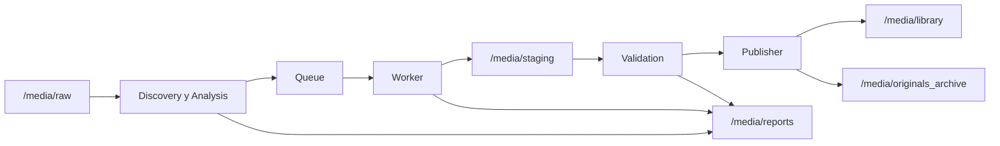
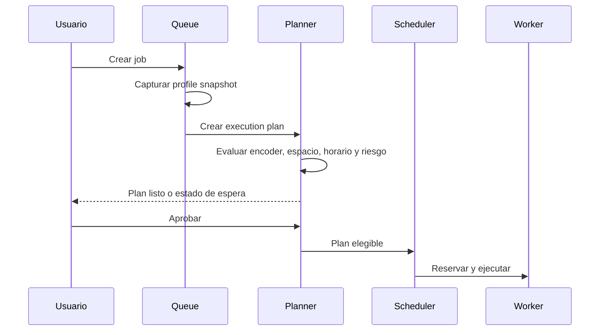

# Cómo usar MediaForge

Esta guía describe el recorrido recomendado desde una instalación nueva hasta una publicación validada.

## Modelo mental

MediaForge controla tres tipos de ubicación:

- **Raw**: archivos originales que entran al flujo.
- **Staging/work**: outputs temporales y workspaces de conversión.
- **Library/published**: archivos finales aceptados por Jellyfin, Plex o Emby.

También conserva:

- **Originals archive**: originales archivados después de publicar, según la política configurada.
- **Reports**: snapshots AS-IS, resultados, logs y diagnósticos.
- **Config**: SQLite y backups.



En la UI y la base de datos utiliza paths internos `/media/...`. Los paths reales del host sólo se configuran en `.env` y Docker Compose.

## 1. Verificar la instalación

En **Dashboard** y **Settings** confirma:

- El backend responde.
- FFmpeg y FFprobe aparecen detectados.
- CPU, memoria y discos tienen valores razonables.
- El runtime profile efectivo corresponde al equipo.
- Los mounts raw, work y library son accesibles.

En una primera ejecución, un dato no detectable puede aparecer como `unknown`; no debe provocar un crash.

## 2. Configurar Settings

Empieza con una política conservadora:

```text
dryRunOnly: true
maxConcurrentJobs: 1
autoWorkerEnabled: true
autoExecutionEnabled: true
autoValidationEnabled: false
autoPublisherEnabled: false
reviewMode: manual
```

Revisa además:

- **Runtime Policy**: perfil detectado, preferido y fallback.
- **Scheduler Limits**: concurrencia, RAM y espacio libre mínimo.
- **Working Hours**: ventanas permitidas para trabajos pesados.
- **Storage Roles**: raw, work, library y report paths.
- **Workspace Strategy**: copia controlada o modo directo cuando sea seguro.
- **Housekeeping**: inicialmente sólo preview/dry run.

## 3. Crear librerías

En **Libraries** registra los destinos bajo `/media/library`. Ejemplos:

```text
/media/library/movies
/media/library/series
/media/library/anime
```

No registres el root completo del NAS. Monta y registra únicamente carpetas dedicadas a MediaForge.

## 4. Incorporar y descubrir assets

Coloca un archivo pequeño bajo el path raw del host. Dentro del contenedor aparecerá, por ejemplo, como:

```text
/media/raw/movies/example.mkv
```

Usa **Scanner**, **Assets** o **Analysis** para inspeccionarlo. MediaForge obtiene streams, codecs, resolución, audio, subtítulos, capítulos y datos necesarios para planificar.

## 5. Revisar el análisis

Antes de convertir:

- Confirma que el asset correcto está seleccionado.
- Revisa el reporte AS-IS.
- Lee warnings y recomendación.
- Comprueba compatibilidad DirectPlay estimada.
- Selecciona una librería de destino.
- Selecciona perfiles de video, audio y tracks adecuados.

El análisis es no destructivo.

## 6. Probar en Profile Lab

En **Profile Lab**:

1. Selecciona el asset.
2. Elige timestamp y duración de muestra.
3. Selecciona perfiles.
4. Compara original y resultado.
5. Revisa comando, codecs, tamaño estimado y warnings.
6. Ajusta o duplica el perfil si es necesario.

Una muestra útil debe representar una escena exigente: movimiento, grano, diálogo, música, subtítulos o cambios de luminosidad.

## 7. Crear y revisar un job

Encola un solo asset. MediaForge captura un **profile snapshot** y genera un **execution plan**.



Revisa:

- Input y output esperado.
- Encoder seleccionado.
- Pixel format y bit depth.
- Quality mode y valor.
- Streams seleccionados.
- Estimación de tamaño y workspace.
- Estado de espera, warnings y razones de decisión.

## 8. Ejecutar dry run

Con `dryRunOnly` activo, ejecuta el job y confirma que:

- No se crea un output real.
- No se mueve el original.
- El comando FFmpeg es el esperado.
- Los paths permanecen dentro de mounts controlados.

Si el comando no es correcto, corrige el perfil y genera un plan nuevo. No edites manualmente un snapshot histórico.

## 9. Ejecutar conversión real

Después del dry run:

1. Desactiva `dryRunOnly`.
2. Mantén concurrencia en uno.
3. Ejecuta el mismo caso de prueba.
4. Observa **Workers**, **Queue** y **Logs**.
5. No reinicies ni actualices el stack durante esta primera conversión salvo que estés probando recuperación deliberadamente.

## 10. Validar y publicar

En **Validation** inspecciona:

- Existencia y legibilidad del output.
- Streams esperados.
- Container, codecs y dimensiones.
- Warnings y score.
- Reproducción de una muestra cuando corresponda.

Si pasa, utiliza **Publisher** manualmente. Confirma:

- El archivo aparece bajo `/media/library`.
- El path definitivo se registra en la base.
- El original se conserva o archiva según la política.
- Reports y logs permanecen disponibles.

## Operación diaria

- **Dashboard**: salud y resumen operativo.
- **Assets**: inventario y procedencia.
- **Analysis**: evaluación antes de procesar.
- **Profiles / Audio / Track Profiles**: contratos de conversión.
- **Queue**: prioridad, batches y estados.
- **Workers**: ejecución activa y comandos.
- **History**: resultados históricos.
- **Validation**: gate de calidad.
- **Publisher**: movimiento final controlado.
- **Logs**: diagnóstico.
- **Settings**: políticas globales.

## Detener y actualizar

Antes de una actualización:

1. Espera a que no haya jobs `running`.
2. Ejecuta el backup de SQLite.
3. Anota la versión actual.
4. Actualiza la imagen.
5. Verifica healthchecks y configuración.
6. Ejecuta un dry run antes de reactivar batches.

## Diagnóstico rápido

| Síntoma | Revisar primero |
|---|---|
| UI no conecta | Estado de `web`, `backend` y `/health` |
| Asset no aparece | Mount raw, permisos y path interno |
| `WAITING_ENCODER` | Runtime snapshot y encoders permitidos por el perfil |
| `WAITING_SSD_SPACE` | Espacio libre y workspace strategy |
| `WAITING_SCHEDULE_WINDOW` | Working Hours y zona horaria |
| Job no inicia | Aprobación, dry run, auto execution y recursos |
| Output no se publica | Validation, publisher y destination path |
| Estado extraño tras reinicio | Scheduler Recovery y logs |

Para las pruebas de aceptación completas consulta [Scheduler v1 — checklist de validación](../scheduler-v1-validation.md).
