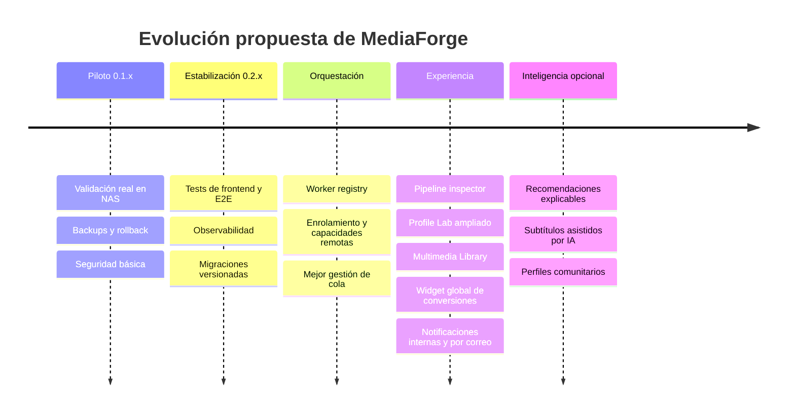

# Roadmap de MediaForge

Esta ruta guarda trabajo futuro y decisiones pendientes. No debe usarse como documentación de funciones disponibles.

## Horizonte

## Documentos activos

- [Siguiente ciclo de trabajo](next-steps.md): prioridades concretas después de `v0.1.0`.

## Documentos de visión relacionados

- [Product Vision](../vision.md)
- [MediaForge V2](../v2_mediaforge.md)
- [Discovery & Analysis V2](../v2-discovery-analysis.md)
- [Project Context](../context.md)

## Regla para actualizar el roadmap

Cada iniciativa debe indicar:

- Problema que resuelve.
- Resultado verificable.
- Dependencias.
- Riesgos para datos o compatibilidad.
- Criterio de aceptación.
- Estado: `propuesto`, `planificado`, `en progreso`, `validado` o `descartado`.

Cuando una función queda validada y publicada, su documentación operativa debe pasar a `docs/guides/`; el roadmap conserva sólo el contexto histórico o el trabajo restante.
