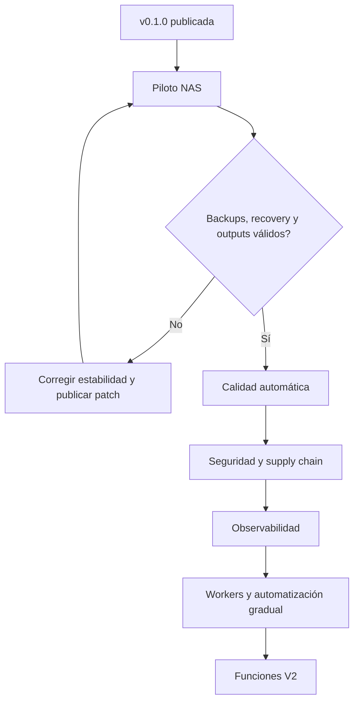

# Próximos pasos después de MediaForge v0.1.0

Estado general: `planificado`.

El objetivo inmediato no es aumentar automatización, sino demostrar que MediaForge puede operar de forma segura y recuperable en el NAS objetivo.

## Flujo de prioridades

## P0 — Piloto NAS real

Estado: `en progreso`.

### Objetivo

Completar el checklist Scheduler v1 en el NAS con archivos descartables y luego con una muestra pequeña representativa.

### Trabajo

- [ ] Instalar `v0.1.0` desde GHCR usando los assets del release.
- [ ] Confirmar arquitectura, permisos, mounts y zona horaria.
- [ ] Confirmar FFmpeg/FFprobe y encoders reales dentro del contenedor.
- [ ] Ejecutar dry run de video, audio y track mapping.
- [ ] Convertir un único asset pequeño.
- [ ] Validar y publicar manualmente.
- [ ] Confirmar archivo del original y persistencia de reports.
- [ ] Reiniciar backend durante una conversión controlada y validar recovery.
- [ ] Reiniciar Docker y el NAS.
- [ ] Ejecutar backup, restaurarlo en un entorno aislado y comprobar integridad.
- [ ] Probar rollback de imagen y base de datos.

### Criterio de aceptación

El [checklist Scheduler v1](../scheduler-v1-validation.md) pasa sin duplicados, pérdida de assets ni contradicciones entre SQLite y filesystem.

## P0 — Readiness y protección de datos

Estado: `propuesto`.

### Problema

`/health` confirma que el proceso HTTP responde, pero no demuestra por sí solo que SQLite, FFmpeg y los mounts críticos estén utilizables.

### Trabajo

- [ ] Separar liveness y readiness.
- [ ] Comprobar conexión y escritura controlada de SQLite.
- [ ] Comprobar presencia de FFmpeg y FFprobe.
- [ ] Comprobar lectura/escritura de roles según su política.
- [ ] Mostrar degradaciones sin filtrar paths sensibles.
- [ ] Añadir smoke test del stack a CI.
- [ ] Documentar y automatizar restauración de backup.
- [ ] Definir política de retención de backups.

### Criterio de aceptación

Compose no marca el backend como listo si no puede ejecutar el flujo mínimo requerido, y una restauración completa está documentada y ensayada.

## P1 — Calidad de código y pruebas

Estado: `propuesto`.

### Trabajo

- [ ] Corregir la línea base del lint del frontend; volver a hacerlo bloqueante.
- [ ] Añadir tests de componentes críticos.
- [ ] Añadir tests E2E para instalación, settings, dry run, validation y publish.
- [ ] Añadir fixtures pequeños de medios con licencias compatibles.
- [ ] Probar migración desde cada versión soportada.
- [ ] Probar imágenes `amd64` y `arm64` en CI o hardware real.
- [ ] Añadir un smoke test que levante backend y web construidos.

### Criterio de aceptación

Ningún release se publica si falla lint, unit tests, integración, migración o smoke test.

## P1 — Migraciones y rollback

Estado: `propuesto`.

### Problema

Las migraciones automáticas simplifican el desarrollo, pero dificultan garantizar downgrade y rollback.

### Trabajo

- [ ] Introducir versiones explícitas de esquema.
- [ ] Registrar la versión de aplicación que realizó cada migración.
- [ ] Crear backup obligatorio previo a una migración productiva.
- [ ] Definir migraciones forward-only y política de restore.
- [ ] Bloquear el arranque de un binario antiguo contra una DB más nueva incompatible.

### Criterio de aceptación

Actualizar y volver a la versión anterior tiene un procedimiento probado y no depende de copiar una SQLite activa.

## P1 — Seguridad de distribución

Estado: `propuesto`.

### Trabajo

- [ ] Añadir archivo de licencia.
- [ ] Escanear imágenes y dependencias en CI.
- [ ] Generar SBOM por release.
- [ ] Firmar imágenes o producir attestations verificables.
- [ ] Fijar actions por SHA o política de actualización controlada.
- [ ] Ejecutar contenedores con el menor privilegio viable.
- [ ] Documentar PUID/PGID o un modelo consistente de ownership para NAS.
- [ ] Añadir autenticación antes de recomendar exposición fuera de una LAN/VPN.
- [ ] Revisar acceso a Swagger y endpoints administrativos.

### Criterio de aceptación

Cada release tiene procedencia verificable, vulnerabilidades revisadas y un modelo de permisos documentado.

## P1 — Rendimiento web y observabilidad

Estado: `propuesto`.

### Trabajo

- [ ] Dividir el bundle principal mediante lazy loading por ruta.
- [ ] Establecer budgets de tamaño en CI.
- [ ] Añadir métricas de jobs, duración, errores, espera y espacio.
- [ ] Diseñar integración opcional con Prometheus/Grafana.
- [ ] Añadir correlación entre job, plan, proceso, log y artifact.
- [ ] Definir rotación de reports y logs de aplicación.

### Criterio de aceptación

Un operador puede explicar por qué un job espera o falló sin acceder manualmente a SQLite.

## P2 — Worker registry y enrolamiento

Estado: `propuesto`.

### Trabajo

- [ ] Identidad y enrolamiento seguro de workers.
- [ ] Heartbeats y expiración.
- [ ] Capacidades y encoders por worker.
- [ ] Scheduling por afinidad, almacenamiento y carga.
- [ ] Revocación y rotación de credenciales.
- [ ] UI de administración.

### Dependencia

Readiness, seguridad y migraciones deben estar estabilizadas antes de distribuir ejecución entre nodos.

## P2 — Experiencia de operación

Estado: `propuesto`.

- [ ] Controles completos de cola: cancelar, retry, prioridad y batch actions.
- [ ] Pipeline Map / Stage Inspector.
- [ ] Profile Lab con comparación visual y métricas ampliadas.
- [ ] Notificaciones de jobs y revisión requerida.
- [ ] Housekeeping con políticas y previews más claros.

## P3 — Producto V2

Estado: `propuesto`.

- [ ] Discovery & Analysis pipeline ampliado.
- [ ] Multimedia Library federada.
- [ ] Procedencia portable mediante metadata/sidecars.
- [ ] Episode Splitter.
- [ ] Perfiles comunitarios con firma, compatibilidad y warnings.
- [ ] Recomendaciones explicables.
- [ ] Traducción de subtítulos asistida por IA, opcional y revisable.

Estas funciones no deben retrasar los gates de seguridad, recuperación y calidad del piloto.

## Deuda conocida al publicar v0.1.0

- El lint del frontend tiene una línea base pendiente y es informativo en CI.
- El bundle web principal supera el tamaño deseado.
- La autenticación de la aplicación no está diseñada para exposición pública.
- Healthcheck es básico.
- SQLite requiere disciplina de una sola instancia y backups previos a upgrades.
- La estrategia de migraciones necesita versionado explícito.

Registrar estas limitaciones permite decidir conscientemente dónde usar `v0.1.x` y evita presentarla como una plataforma productiva sin reservas.
