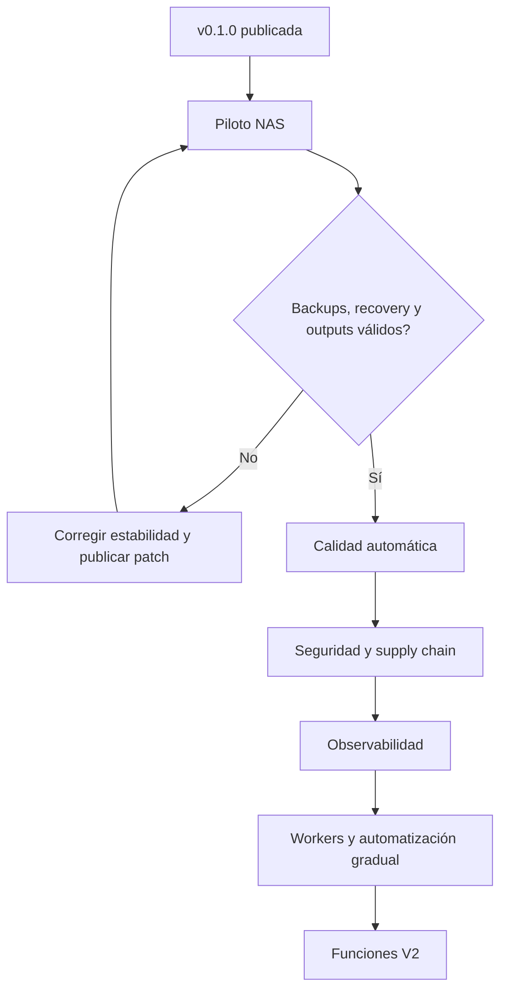

# Próximos pasos después de MVForge v0.1.0

Estado general: `planificado`.

El objetivo inmediato no es aumentar automatización, sino demostrar que MVForge puede operar de forma segura y recuperable en el NAS objetivo.

## Flujo de prioridades

## P0 — Piloto NAS real

Estado: `en progreso`.

### Objetivo

Completar el checklist Scheduler v1 en el NAS con archivos descartables y luego con una muestra pequeña representativa.

### Trabajo

- [ ] Instalar `v0.1.0` desde GHCR usando los assets del release.
- [ ] Confirmar arquitectura, permisos, mounts y zona horaria.
- [ ] Confirmar FFmpeg/FFprobe y encoders reales dentro del contenedor.
- [ ] Ejecutar dry run de video, audio y track mapping.
- [ ] Convertir un único asset pequeño.
- [ ] Validar y publicar manualmente.
- [ ] Confirmar archivo del original y persistencia de reports.
- [ ] Reiniciar backend durante una conversión controlada y validar recovery.
- [ ] Reiniciar Docker y el NAS.
- [ ] Ejecutar backup, restaurarlo en un entorno aislado y comprobar integridad.
- [ ] Probar rollback de imagen y base de datos.

### Criterio de aceptación

El [checklist Scheduler v1](../scheduler-v1-validation.md) pasa sin duplicados, pérdida de assets ni contradicciones entre SQLite y filesystem.

## P0 — Readiness y protección de datos

Estado: `propuesto`.

### Problema

`/health` confirma que el proceso HTTP responde, pero no demuestra por sí solo que SQLite, FFmpeg y los mounts críticos estén utilizables.

### Trabajo

- [ ] Separar liveness y readiness.
- [ ] Comprobar conexión y escritura controlada de SQLite.
- [ ] Comprobar presencia de FFmpeg y FFprobe.
- [ ] Comprobar lectura/escritura de roles según su política.
- [ ] Mostrar degradaciones sin filtrar paths sensibles.
- [ ] Añadir smoke test del stack a CI.
- [ ] Documentar y automatizar restauración de backup.
- [ ] Definir política de retención de backups.

### Criterio de aceptación

Compose no marca el backend como listo si no puede ejecutar el flujo mínimo requerido, y una restauración completa está documentada y ensayada.

## P1 — Calidad de código y pruebas

Estado: `propuesto`.

### Trabajo

- [ ] Corregir la línea base del lint del frontend; volver a hacerlo bloqueante.
- [ ] Añadir tests de componentes críticos.
- [ ] Añadir tests E2E para instalación, settings, dry run, validation y publish.
- [ ] Añadir fixtures pequeños de medios con licencias compatibles.
- [ ] Probar migración desde cada versión soportada.
- [ ] Probar imágenes `amd64` y `arm64` en CI o hardware real.
- [ ] Añadir un smoke test que levante backend y web construidos.

### Criterio de aceptación

Ningún release se publica si falla lint, unit tests, integración, migración o smoke test.

## P1 — Migraciones y rollback

Estado: `propuesto`.

### Problema

Las migraciones automáticas simplifican el desarrollo, pero dificultan garantizar downgrade y rollback.

### Trabajo

- [ ] Introducir versiones explícitas de esquema.
- [ ] Registrar la versión de aplicación que realizó cada migración.
- [ ] Crear backup obligatorio previo a una migración productiva.
- [ ] Definir migraciones forward-only y política de restore.
- [ ] Bloquear el arranque de un binario antiguo contra una DB más nueva incompatible.

### Criterio de aceptación

Actualizar y volver a la versión anterior tiene un procedimiento probado y no depende de copiar una SQLite activa.

## P1 — Seguridad de distribución

Estado: `propuesto`.

### Trabajo

- [ ] Añadir archivo de licencia.
- [ ] Escanear imágenes y dependencias en CI.
- [ ] Generar SBOM por release.
- [ ] Firmar imágenes o producir attestations verificables.
- [ ] Fijar actions por SHA o política de actualización controlada.
- [ ] Ejecutar contenedores con el menor privilegio viable.
- [ ] Documentar PUID/PGID o un modelo consistente de ownership para NAS.
- [ ] Añadir autenticación antes de recomendar exposición fuera de una LAN/VPN.
- [ ] Revisar acceso a Swagger y endpoints administrativos.

### Criterio de aceptación

Cada release tiene procedencia verificable, vulnerabilidades revisadas y un modelo de permisos documentado.

## P1 — Rendimiento web y observabilidad

Estado: `propuesto`.

### Trabajo

- [ ] Dividir el bundle principal mediante lazy loading por ruta.
- [ ] Establecer budgets de tamaño en CI.
- [ ] Añadir métricas de jobs, duración, errores, espera y espacio.
- [ ] Diseñar integración opcional con Prometheus/Grafana.
- [ ] Añadir correlación entre job, plan, proceso, log y artifact.
- [ ] Definir rotación de reports y logs de aplicación.

### Criterio de aceptación

Un operador puede explicar por qué un job espera o falló sin acceder manualmente a SQLite.

## P2 — Worker registry y enrolamiento

Estado: `propuesto`.

### Trabajo

- [ ] Identidad y enrolamiento seguro de workers.
- [ ] Heartbeats y expiración.
- [ ] Capacidades y encoders por worker.
- [ ] Scheduling por afinidad, almacenamiento y carga.
- [ ] Revocación y rotación de credenciales.
- [ ] UI de administración.

### Dependencia

Readiness, seguridad y migraciones deben estar estabilizadas antes de distribuir ejecución entre nodos.

## P2 — Experiencia de operación

Estado: `propuesto`.

- [ ] Controles completos de cola: cancelar, retry, prioridad y batch actions.
- [ ] Pipeline Map / Stage Inspector.
- [ ] Profile Lab con comparación visual y métricas ampliadas.
- [ ] Widget global y persistente de conversiones activas.
- [ ] Centro de notificaciones dentro de MVForge.
- [ ] Notificaciones opcionales por correo para jobs, batches y revisiones.
- [ ] Housekeeping con políticas y previews más claros.

### Fase — Timeline visual de stages en Queue

Estado: `planificado`.

#### Problema

Queue muestra únicamente el stage vigente junto con todos los datos operativos
en una misma línea. Esto dificulta reconocer qué etapas ya terminaron, dónde se
encuentra el asset y en cuál falló. La preparación de subtítulos también agrupa
extracción, conversión y OCR bajo un solo stage.

#### Resultado verificable

Cada job mostrará dos renglones debajo de su encabezado:

1. Un timeline de tags con los stages aplicables al asset.
2. Worker, prioridad, progreso, biblioteca, perfiles, tiempo transcurrido y ETA.

Los tags usarán estos estados visuales:

- Sin color: pendiente, omitido o todavía no alcanzado.
- Azul: stage actual.
- Verde: stage completado correctamente según `stageHistory`.
- Rojo: stage operativo donde ocurrió el error.
- `failed` y `canceled` permanecerán como resultados terminales explícitos.

El primer alcance usará los stages que ya persiste el backend:

1. `queued`
2. `claimed`
3. `preparing_workspace`
4. `copying_to_workspace`
5. `analyzing_as_is`
6. `preparing_subtitles`
7. `converting`
8. `validating`
9. `directplay_analysis`
10. `ready_to_publish`
11. `publishing`
12. `archiving_original`
13. `cleaning_workspace`
14. `completed`
15. `failed`
16. `canceled`

Una ampliación posterior dividirá el trabajo de subtítulos en stages medibles:

- `preparing_subtitles`
- `extracting_subtitles`
- `converting_subtitles`
- `ocr_subtitles`
- `subtitle_artifacts_ready`

No se agregará `preparing_asset` mientras se solape con
`preparing_workspace` y `analyzing_as_is`.

#### Dependencias

- Usar `stageHistory` como fuente del recorrido, sin inferirlo del porcentaje.
- Registrar el stage operativo que falla antes de transicionar a `failed`.
- Definir qué stages son opcionales para conversión, remux, publicación as-is y
  jobs sin subtítulos.
- Añadir transiciones persistentes antes de mostrar los nuevos substages de
  subtítulos en la UI.

#### Riesgos

- Un stage omitido no debe aparentar un fallo.
- Los jobs históricos con `stageHistory` incompleto deben degradar a una vista
  neutral sin inventar etapas completadas.
- El timeline debe envolver correctamente en móvil y no ampliar el ancho de la
  tarjeta de Queue.

#### Criterio de aceptación

Un operador puede reconocer visualmente el stage actual, todos los stages ya
completados y el punto exacto de fallo. La información operativa queda en un
renglón independiente y los jobs históricos continúan siendo legibles aunque
carezcan de un historial completo.

### Widget global de conversiones

El layout principal mostrará un widget flotante y minimizable, similar al panel
de transferencias de Google Drive o MEGA. Debe permanecer visible al navegar
entre Dashboard, Assets, Queue, Workers y Settings.

Por cada conversión activa mostrará:

- Nombre del asset y job.
- Worker que lo está procesando, por ejemplo NAS o MacBook.
- Etapa actual: análisis, conversión, validación o publicación.
- Progreso, tiempo transcurrido y ETA cuando pueda calcularse.
- Encoder efectivo y estado del worker.
- Accesos directos al detalle, logs y página Workers.
- Estado de finalización, error, cancelación o espera.

El widget podrá expandirse, minimizarse y ocultar jobs terminados. Minimizarlo no
detendrá la conversión. Los jobs activos deben conservarse tras recargar la
página y actualizarse por eventos del servidor; polling será el fallback.

### Notificaciones de jobs

MVForge incorporará un centro de notificaciones persistente y canales
opcionales de navegador y correo. El usuario podrá activar cada canal y evento
por separado.

Eventos iniciales:

- Job completado, fallido o cancelado.
- Batch completado o completado con errores.
- Worker desconectado, sin heartbeat o necesitando atención.
- Job esperando revisión, espacio, encoder o worker.
- Validación o publicación completada o fallida.

El correo será opt-in y requerirá configuración SMTP, destinatarios de prueba,
TLS y un botón **Send test email**. No se almacenará la contraseña SMTP en texto
plano en logs ni respuestas de la API. Para evitar ruido debe soportar eventos
configurables, horas silenciosas y resúmenes por batch.

Cada notificación incluirá job, asset, resultado, worker, duración y un enlace
al detalle correspondiente. Los enlaces externos sólo se generarán cuando el
administrador configure explícitamente la URL pública/base de MVForge.

### Criterio de aceptación

Mientras existe una conversión activa, el operador puede ver desde cualquier
página qué worker procesa qué asset y abrir sus detalles. Al terminar o fallar
el job aparece una notificación interna y, si SMTP está habilitado para ese
evento, se envía exactamente un correo incluso después de reintentos o reinicios.

## P3 — Producto V2

Estado: `propuesto`.

- [ ] Discovery & Analysis pipeline ampliado.
- [ ] Multimedia Library federada.
- [ ] Procedencia portable mediante metadata/sidecars.
- [ ] Episode Splitter.
- [ ] Perfiles comunitarios con firma, compatibilidad y warnings.
- [ ] Recomendaciones explicables.
- [ ] Traducción de subtítulos asistida por IA, opcional y revisable.

Estas funciones no deben retrasar los gates de seguridad, recuperación y calidad del piloto.

## Fase posterior — Matriz multicodec

Estado: `diferido`.

Ampliar la selección actual para que el flujo sea:

`Codec → Software/Hardware → Encoder probado → Preset y controles compatibles`

La UI no debe anunciar una combinación sólo porque FFmpeg liste el encoder. Las
opciones disponibles deben proceder de probes del worker y mantener separadas la
configuración solicitada y la efectiva. Cada codec nuevo debe cubrir LAB,
Profiles, Quick Asset Overrides, pipeline, estimaciones, command preview,
snapshots, jobs, reportes, logs y pruebas de generación de comandos.

### Orden recomendado

1. H.264/AVC completo: `libx264`, QSV y VideoToolbox primero; NVENC/VAAPI después.
2. AV1 software con SVT-AV1.
3. AV1 hardware mediante QSV, NVENC o VAAPI únicamente cuando el probe real lo valide.
4. FFV1 o ProRes para preservación y masters intermedios.
5. VP9 sólo si existe una necesidad web concreta.
6. MPEG-2 únicamente para workflows legacy.

### Esfuerzo estimado

| Codec | Implementaciones previstas | Esfuerzo |
| --- | --- | ---: |
| H.264/AVC | libx264, QSV, VideoToolbox, NVENC, VAAPI | 5–8 días |
| AV1 | SVT-AV1/AOM, QSV, NVENC, VAAPI | 8–13 días |
| VP9 | libvpx-vp9 y hardware validado | 5–8 días |
| MPEG-2 | mpeg2video, principalmente software | 2–4 días |
| ProRes | prores_ks y VideoToolbox | 4–7 días |
| FFV1 | software lossless | 2–4 días |

Las validaciones finales por familia de hardware pueden agregar uno o dos días.

### Trabajo obligatorio por codec

- Normalización de familia, nombres y contenedores compatibles.
- Encoders de software y hardware independientes.
- Probes por encoder, pixel format, bit depth, profile y rate control.
- Presets calibrados por codec, encoder, resolución y tipo de fuente.
- Exclusión en UI de parámetros incompatibles.
- Cálculo de bitrate, tamaño, ahorro y tiempo esperado.
- Fallbacks explícitos y registro de opciones descartadas.
- Fidelity, review técnico y command preview consistentes.
- Persistencia de configuración solicitada y efectiva en artefactos del job.
- Pruebas unitarias de presets, mappings y comandos FFmpeg.

### Primer incremento recomendado

Implementar H.264 software, QSV y VideoToolbox. Debe incluir profiles
Baseline/Main/High, 8-bit, pixel formats compatibles, GOP, B-frames y controles
de calidad propios de cada encoder. No se deben reutilizar directamente los
valores de HEVC ni asumir equivalencia entre CRF, ICQ y bitrate.

## Deuda conocida al publicar v0.1.0

- El lint del frontend tiene una línea base pendiente y es informativo en CI.
- El bundle web principal supera el tamaño deseado.
- La autenticación de la aplicación no está diseñada para exposición pública.
- Healthcheck es básico.
- SQLite requiere disciplina de una sola instancia y backups previos a upgrades.
- La estrategia de migraciones necesita versionado explícito.

Registrar estas limitaciones permite decidir conscientemente dónde usar `v0.1.x` y evita presentarla como una plataforma productiva sin reservas.
