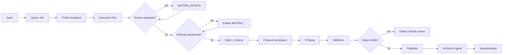
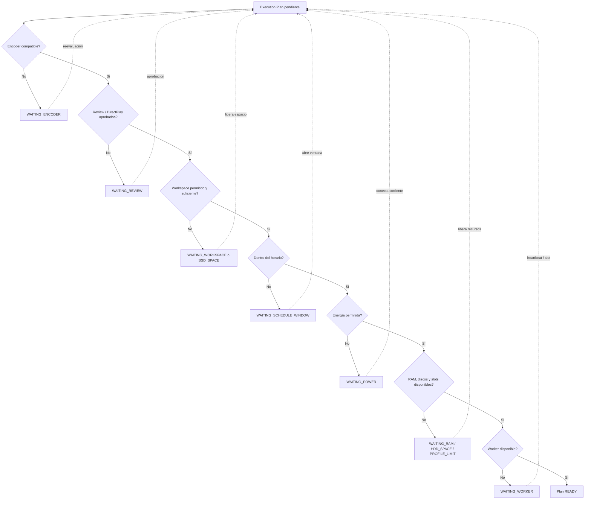
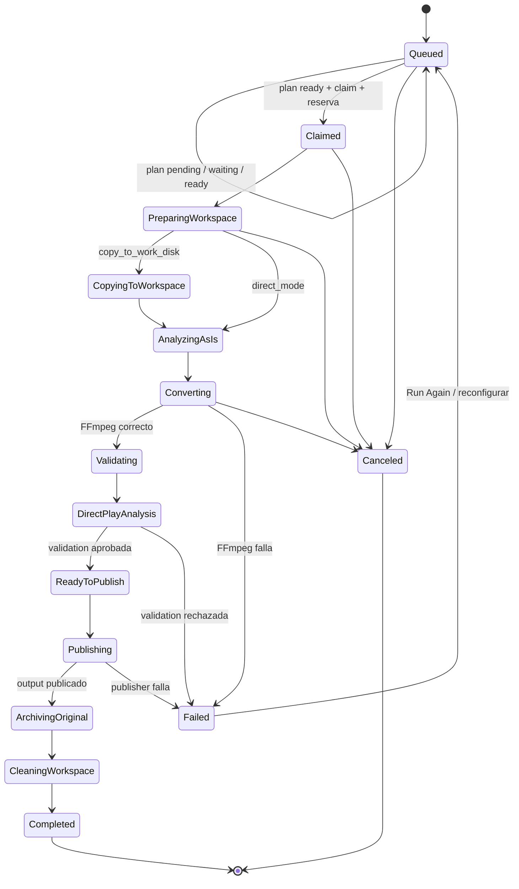
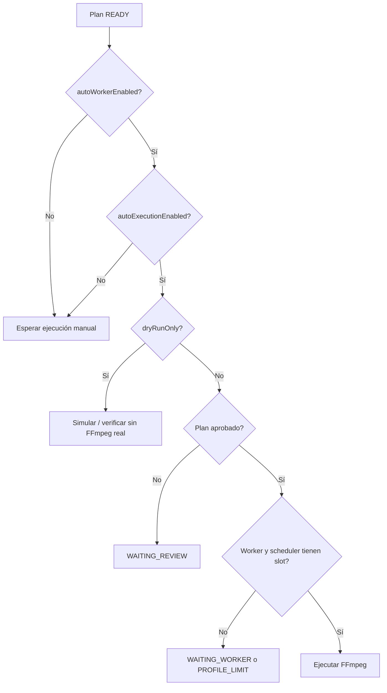
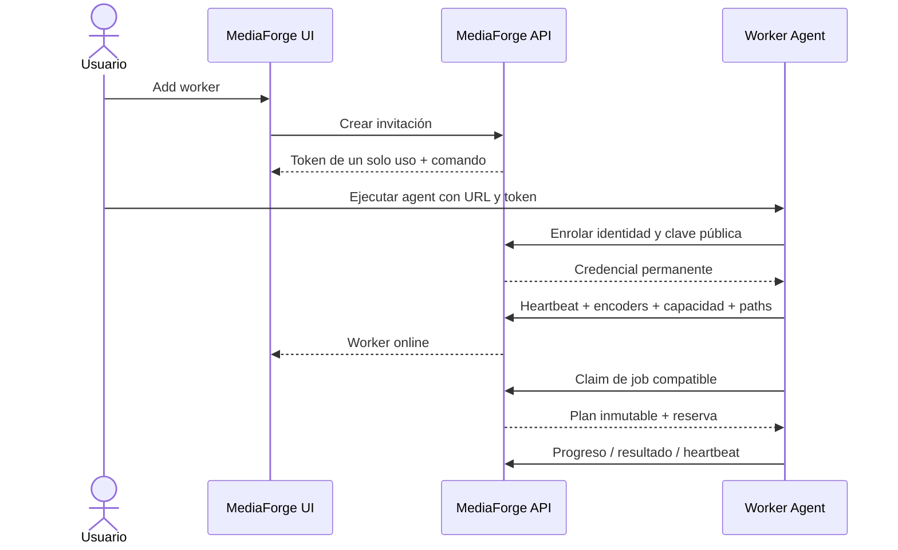

# MediaForge Scheduler v1

Esta guía describe cómo funciona el scheduler implementado en MediaForge, cómo toma decisiones y qué controla cada setting. Para las pruebas de aceptación consulta también [scheduler-v1-validation.md](scheduler-v1-validation.md).

## 1. Qué hace el scheduler

El scheduler convierte un job de la cola en una ejecución controlada. Antes de iniciar FFmpeg:

1. Conserva una copia del perfil seleccionado dentro del job.
2. Genera un **Execution Plan** versionado.
3. Resuelve codecs, encoder, calidad, output y workspace.
4. Calcula tamaños estimados de output y espacio temporal.
5. Evalúa aprobación, DirectPlay, horario, worker, energía, memoria, discos y límites de concurrencia.
6. Deja el plan listo o explica por qué está esperando.
7. Reserva el asset y los recursos antes de iniciar el proceso.

El perfil seleccionado es el contrato principal. Sus codecs y encoders prevalecen sobre inferencias generales; los overrides explícitos aplicables al asset se incorporan al plan.

## 2. Flujo de un job

```text
Asset
  → Queue Job
  → Profile Snapshot
  → Execution Plan
  → Review / aprobación
  → Espera de horario, recursos o worker
  → Reserva y claim
  → Workspace
  → FFmpeg
  → Validation
  → Publisher
  → Archive / Housekeeping
```



La cola se ordena por `priority` ascendente y luego por fecha de creación. Por tanto, una prioridad numérica menor se ejecuta primero; a igual prioridad, gana el job más antiguo.

### Profile Snapshot

Al crear o reconfigurar un job, MediaForge captura el perfil. Una edición posterior del perfil global no cambia silenciosamente el contrato de un job existente. Si cambia la configuración del job, se crea una nueva versión del plan y la anterior queda reemplazada.

### Execution Plan

El plan permite revisar antes de ejecutar:

- Perfil y versión.
- Familia de codec y encoder seleccionado.
- Bit depth, pixel format, modo y valor de calidad.
- Input, output y modo de workspace.
- Tamaño mínimo/máximo estimado del output.
- Espacio temporal estimado.
- Runtime usado para decidir.
- Warnings, razones, constraints y fuentes de decisión.
- Aprobación y causa de espera.

La estimación de tamaño es orientativa. Depende de duración, bitrate, codec y confianza disponible; el tamaño definitivo solo existe después de convertir.

## 3. Review y aprobación

`pipelineAutomation.reviewMode` define quién aprueba el plan:

| Valor | Comportamiento |
|---|---|
| `manual` | Todos los planes esperan aprobación humana. |
| `automatic` | Los planes válidos se autoaprueban. |
| `conditional` | Los planes seguros se autoaprueban; warnings o políticas que exigen revisión los detienen. |

Estados de aprobación:

- `pending`: falta decisión.
- `auto_approved`: aprobado por política.
- `manually_approved`: aprobado desde la UI/API.
- `rejected`: rechazado; no puede ejecutarse.

La aprobación no fuerza una ejecución. Un plan aprobado todavía debe cumplir horario, workspace, energía, recursos y disponibilidad del worker.

### Cómo se evalúa un plan



## 4. Estados de espera

| Estado | Significado |
|---|---|
| `WAITING_REVIEW` | Requiere aprobación manual. |
| `WAITING_DIRECTPLAY_REVIEW` | La política DirectPlay exige revisión. |
| `WAITING_ENCODER` | No existe un encoder compatible disponible. |
| `WAITING_SCHEDULE_WINDOW` | Está fuera del horario permitido. |
| `WAITING_WORKSPACE` / `WAITING_SSD_SPACE` | No puede preparar el workspace o faltaría reserva en work. |
| `WAITING_HDD_SPACE` | El destino quedaría debajo de la reserva de library. |
| `WAITING_RAM` | Memoria libre inferior al mínimo. |
| `WAITING_PROFILE_LIMIT` | Se alcanzó un límite global o por clase de trabajo. |
| `WAITING_WORKER` | No hay worker elegible o disponible. |
| `WAITING_POWER` | La máquina está en batería y la política impide comenzar. |

El review planner reevalúa periódicamente los planes en espera. Cuando desaparece la causa, el plan puede volver a `ready` sin recrear el job.

### Estados del job y del plan

El estado del plan explica si la ejecución puede comenzar; el stage del job explica en qué parte del pipeline está el asset.



## 5. Settings

Los settings se administran en **Settings**. Los valores que aparecen aquí son los defaults de una instalación nueva.

### Workers

| Setting | Default | Función |
|---|---:|---|
| `defaultWorkerName` | `local-worker` | Worker local que reclama jobs automáticos. |
| `autoWorkerEnabled` | `true` | Permite que el worker local busque jobs. |
| `maxConcurrentJobs` | `1` | Claims simultáneos permitidos para el worker. |
| `maxJobsPerBatch` | `10` | Máximo procesado antes del cooldown del batch. |
| `delaySecondsBetweenJobs` | `30` | Pausa mínima entre inicios. |
| `batchCooldownSeconds` | `600` | Descanso después de alcanzar el límite del batch. |
| `dryRunOnly` | `true` | No inicia FFmpeg; prepara y verifica el flujo de ejecución. |

Para ejecutar conversiones reales deben estar activos `autoWorkerEnabled` y `pipelineAutomation.autoExecutionEnabled`, y `dryRunOnly` debe estar desactivado.

### Cómo se combinan los controles de ejecución



### Pipeline Automation

| Setting | Default | Función |
|---|---:|---|
| `autoAnalysisEnabled` | `false` | Reserva la automatización del análisis previo. |
| `reviewMode` | `conditional` | Política de aprobación descrita arriba. |
| `autoExecutionEnabled` | `true` | Autoriza al auto worker a reclamar planes listos. |
| `autoValidationEnabled` | `false` | Ejecuta validation automáticamente al terminar. |
| `autoPublisherEnabled` | `false` | Publica automáticamente outputs válidos. |

Una configuración inicial segura conserva `dryRunOnly: true`, validation manual y publisher manual hasta validar el entorno.

### Runtime Policy

| Setting | Default | Función |
|---|---:|---|
| `mode` | `automatic` | Detecta máquina y selecciona un perfil; `manual` usa el elegido por el usuario. |
| `selectedProfile` | `desktop_balanced` | Perfil usado en modo manual. |
| `fallbackProfile` | `desktop_safe` | Perfil conservador si la detección no es concluyente. |
| `pauseWhenOnBattery` | `false` | Impide iniciar nuevos jobs en batería. |
| `preventSleepDuringJobs` | `false` | En macOS acompaña FFmpeg con `caffeinate`. |

Perfiles disponibles: `nas_safe`, `nas_balanced`, `desktop_safe`, `desktop_balanced`, `laptop_safe`, `workstation_balanced`, `workstation_aggressive` y `custom`.

**Refresh detection** actualiza el snapshot persistido: sistema operativo, CPU, memoria, encoders FFmpeg, discos, espacio, carga y energía cuando el sistema puede reportarlos. El plan guarda qué snapshot utilizó.

### Scheduler Limits

Con `useProfileDefaults: true` (default), los límites provienen del perfil de runtime. Los números personalizados permanecen guardados, pero solo se aplican al desactivar esa opción.

| Setting personalizado | Default almacenado | Función |
|---|---:|---|
| `maxRunningJobs` | `2` | Total de reservas activas. |
| `maxVideoJobs` | `2` | Conversiones de video simultáneas. |
| `maxSoftwareX265Jobs` | `1` | Encodes `libx265` simultáneos. |
| `maxHardwareEncodeJobs` | `2` | Encodes por hardware simultáneos. |
| `maxAudioJobs` | `3` | Trabajos de audio simultáneos. |
| `maxLabJobs` | `1` | Previews/Lab simultáneos. |
| `minFreeRamGb` | `4` | Memoria que debe quedar libre. |
| `minFreeWorkGb` | `40` | Reserva libre después de preparar workspace. |
| `minFreeLibraryGb` | `50` | Reserva libre después del output estimado. |
| `maxWorkspaceGb` | `300` | Máximo temporal aceptable por plan. |
| `allowDirectMode` | `true` | Permite leer raw directamente según política. |

Estos límites conviven con `workers.maxConcurrentJobs`: debe cumplirse tanto el límite del worker como el del scheduler.

### Working Hours

- `enabled` activa las ventanas.
- `timezone` usa un nombre IANA, por ejemplo `America/Mexico_City`.
- `windows` contiene nombre, días (`mon`…`sun`), inicio y fin.
- Una ventana como `23:00–07:00` cruza medianoche correctamente.
- Inicio y fin iguales representan 24 horas desde el día configurado.

`outsideWindowPolicy.startNewHeavyJobs` decide si las conversiones pesadas pueden comenzar fuera de ventana. Su default es `true`; para que las ventanas restrinjan conversiones debe ponerse en `false`.

La política también conserva flags para permitir analysis, validation, publisher, cleanup y Lab fuera de ventana. Los jobs ya iniciados no se interrumpen cuando termina una ventana si `continueRunningJobs` permanece activo.

### Workspace Strategy

| Setting | Default | Función |
|---|---:|---|
| `preferredMode` | `copy_to_work_disk` | Copia el input al disco work antes de convertir. |
| `fallbackMode` | `wait` | Espera si no cabe; alternativamente puede usar `direct_mode`. |
| `allowDirectMode` | `false` | Autoriza el fallback leyendo raw directamente. |
| `estimateRequiredSpace` | `true` | Reserva input, output estimado y overhead. |

Los roles `raw`, `library`, `originals_archive`, `work`, `cache`, `reports` y `logs` desacoplan la política de paths concretos del host. Housekeeping solo puede eliminar directorios directos `job-N` dentro del rol `work`.

### DirectPlay

DirectPlay es un preflight, no una garantía del archivo final.

- `enabled`: default `true`.
- `strategy`: default `balanced`.
- `targetClients`: clientes Jellyfin y Apple TV incluidos inicialmente.
- `minimumScore`: default `70`.
- `enforcement: warn` registra advertencia; `block` exige revisión manual si el score queda bajo el umbral.

### Housekeeping

| Setting | Default | Función |
|---|---:|---|
| `autoEnabled` | `true` | Ejecuta limpieza periódica. |
| `intervalHours` | `24` | Intervalo mínimo. |
| `failedRetentionDays` | `7` | Conservación de workspaces fallidos. |
| `canceledRetentionDays` | `3` | Conservación de cancelados. |
| `orphanRetentionDays` | `7` | Conservación de directorios sin job. |

Los workspaces publicados pueden limpiarse inmediatamente. Nunca son candidatos los jobs queued/running ni los completed sin publicar. La limpieza manual exige un preview fresco —máximo 15 minutos— antes de eliminar.

## 6. Reservas, locks y concurrencia

Al crear un job se bloquea su path para evitar dos jobs abiertos sobre el mismo asset. Al hacer claim se activa una reserva con worker, tipo, encoder, clase de encoder, memoria y espacio estimado. La operación es transaccional: dos workers no pueden reclamar el mismo job ni exceder correctamente un único slot.

El claim local serializa en una sección crítica la comprobación del slot, la
selección del job, la activación de la reserva y la transición a `running`. La
conexión SQLite utiliza WAL, `busy_timeout=5000` y un único writer para evitar
que los servicios periódicos compitan por escrituras. Esta garantía cubre una
instancia backend; dos procesos contra el mismo archivo SQLite no están
soportados.

Las reservas se liberan al finalizar, fallar o cancelar. En el arranque, la reconciliación repara reservas antiguas y detecta jobs que quedaron running durante un reinicio.

## 7. Reinicio y recuperación

MediaForge no reinicia automáticamente un FFmpeg perdido. Al arrancar:

- Marca como interrumpidos los jobs que figuraban running sin proceso controlado.
- Libera reservas inconsistentes.
- Conserva evidencia, logs y outputs existentes para diagnóstico.
- Detecta workspaces huérfanos para housekeeping.
- Revisa si outputs registrados como publicados todavía existen.

Esto prioriza evitar una segunda conversión o una publicación ambigua.

## 8. Configuraciones recomendadas

### Primera prueba segura

```json
{
  "workers": { "autoWorkerEnabled": true, "maxConcurrentJobs": 1, "dryRunOnly": true },
  "pipelineAutomation": { "reviewMode": "manual", "autoExecutionEnabled": true, "autoValidationEnabled": false, "autoPublisherEnabled": false }
}
```

### Producción conservadora

- `reviewMode: conditional`.
- `dryRunOnly: false` después de validar FFmpeg.
- Un solo software x265 simultáneo.
- Reservas de disco adaptadas al volumen real.
- Validation automática antes de habilitar publisher automático.
- `pauseWhenOnBattery: true` en portátiles.
- Housekeeping automático, manteniendo preview para ejecuciones manuales.

## 9. Diagnóstico rápido

Si un job no comienza:

1. Abre su Execution Plan y lee `waitingState` y `decisionReasons`.
2. Confirma que el plan está aprobado y no rechazado.
3. Comprueba `autoWorkerEnabled`, `autoExecutionEnabled` y `dryRunOnly`.
4. Revisa el runtime snapshot y los encoders detectados.
5. Revisa ventanas horarias, batería, RAM y reservas de discos.
6. Confirma que no existe otro job abierto para el mismo path.
7. Revisa worker heartbeat, reservations y logs.

Si el job termina pero no aparece en la librería, el problema ya no es dispatch: revisa Validation, `autoPublisherEnabled`, el path publicado, el archive del original y luego Housekeeping.

La página **Logs** reúne backend HTTP/pánicos, eventos del sistema, decisiones
del scheduler, workers y claims, lifecycle general del pipeline y detalle por
job. `backend.log` es persistente y rotado; los logs consolidados de scheduler,
workers y pipeline se reconstruyen desde la DB para conservar contexto
operativo aunque un evento no se haya escrito originalmente como archivo. Para
procedimientos concretos consulta
[Diagnóstico y troubleshooting](guides/troubleshooting.md).

## 10. Runtime Profiles efectivos

Esta fase amplía Scheduler v1 para que Runtime Policy sea configurable sin modificar los presets oficiales.

### Objetivo

```text
Perfil oficial inmutable
        +
Overrides del usuario por perfil
        =
Runtime efectivo
```

La detección automática seguirá recomendando un perfil según la máquina. El usuario podrá elegir `Auto recommended` o un perfil preferido, revisar todas sus propiedades y sobrescribir campos individuales. La UI deberá distinguir siempre valor oficial, override y valor efectivo.

### Entregables

1. Catálogo backend de Runtime Profiles oficiales con nombre, descripción, límites y comportamiento energético.
2. Endpoint para consultar el catálogo; el frontend no mantendrá una lista duplicada.
3. Resolución única de `detectedProfile`, `preferredProfile`, `fallbackProfile`, overrides y perfil efectivo.
4. Overrides persistentes por perfil, sin modificar las definiciones oficiales.
5. Migración de `selectedProfile` y `schedulerLimits` actuales al nuevo esquema.
6. Snapshot con perfil detectado, base, efectivo, overrides y razones de selección.
7. Panel que actualice el formulario al cambiar de perfil y marque campos `Official` u `Overridden`.
8. Acciones `Reset field` y `Reset all overrides`.
9. Pruebas que demuestren que Runtime Policy limita concurrencia, pero nunca sustituye el encoder bloqueado por un perfil de conversión.

Configuración conceptual:

```json
{
  "mode": "automatic",
  "preferredProfile": "workstation_balanced",
  "fallbackProfile": "desktop_safe",
  "overrides": {
    "workstation_balanced": {
      "maxSoftwareX265Jobs": 1,
      "minFreeWorkGb": 150,
      "preventSleepDuringJobs": true
    }
  }
}
```

### Contrato entre Scheduler Limits y Worker Settings

Ambos límites se conservan porque representan niveles diferentes:

```text
Scheduler Limits
  = capacidad global permitida por la máquina y la política

Worker capacity
  = capacidad máxima de un ejecutor concreto

Capacidad efectiva
  = el menor límite aplicable
```

Ejemplo:

```text
Scheduler maxRunningJobs = 3
local-worker maxConcurrentJobs = 1

Resultado: local-worker ejecuta 1 job.
```

Con dos workers de capacidad 2 y un límite global de 3, MediaForge podrá ejecutar como máximo 3 jobs entre ambos, nunca 4.

Los Worker Settings se reorganizarán así:

| Setting | Destino | Motivo |
|---|---|---|
| `defaultWorkerName` | Conservar | Identifica el ejecutor local. |
| `autoWorkerEnabled` | Conservar | Enciende o apaga el claim automático local. |
| `maxConcurrentJobs` | Conservar y renombrar visualmente como **Worker capacity** | Será importante con workers remotos; no reemplaza el límite global. |
| `maxJobsPerBatch` | Conservar en **Execution pacing** | Controla carga sostenida, no concurrencia global. |
| `delaySecondsBetweenJobs` | Conservar en **Execution pacing** | Evita inicios consecutivos agresivos. |
| `batchCooldownSeconds` | Conservar en **Execution pacing** | Introduce descanso después de un lote. |
| `dryRunOnly` | Conservar y destacar | Es un interruptor de seguridad del ejecutor. |

La UI debe mostrar la capacidad efectiva y su causa, por ejemplo:

```text
Global scheduler capacity: 3
local-worker capacity:      1
Effective local capacity:   1
Limited by:                 Worker capacity
```

En una instalación con un solo worker, ambos números pueden parecer redundantes, pero no deben fusionarse en la persistencia: Scheduler Limits pertenece a la política de la máquina; Worker capacity pertenece al ejecutor y prepara el modelo para workers distribuidos.

### Regla de encoders

Runtime Policy y Worker Settings pueden retrasar un job, pero no cambiar su contrato de conversión:

```text
Perfil de conversión: locked / libx265
Runtime: maxSoftwareX265Jobs = 1

Asset 1 → libx265 → running
Asset 2 → libx265 → WAITING_PROFILE_LIMIT
```

Un encoder alternativo solo puede seleccionarse si aparece explícitamente en `allowedEncoders` del perfil de conversión. La saturación de un slot nunca debe introducir hardware como fallback implícito.

## 11. Fase posterior — Worker Registry y enrolamiento

Actualmente MediaForge solo tiene un worker administrado realmente: `local-worker`. El backend registra su heartbeat, detecta sus encoders y ejecuta FFmpeg en la misma máquina. El campo de nombre del claim manual únicamente asigna un nombre al claim; no instala, registra ni conecta otro ejecutor.

Esta fase permitirá agregar workers desde la UI y distinguir dos modalidades:

```text
Local managed worker
  → corre dentro del backend actual

Remote worker agent
  → corre MediaForge Agent en otra máquina
  → se enrola con un token temporal
  → reporta capacidades y reclama jobs compatibles
```

### Primer alcance recomendado

Los primeros workers remotos requerirán storage compartido. Tanto servidor como worker deben poder acceder al mismo asset y destinos, aunque utilicen paths diferentes mediante mappings.

```text
Servidor: /media/raw/anime/ep01.mkv
Worker:   /mnt/nas/raw/anime/ep01.mkv
```

La transferencia automática de archivos entre nodos se deja para Distributed Workers, porque necesita checksums, reanudación, cuotas y manejo de fallos de red.

### Flujo para agregar un worker



El wizard **Add Worker** mostrará:

1. Nombre y descripción.
2. Tipo `Remote agent`.
3. URL que el agent utilizará para conectar con MediaForge.
4. Token temporal con expiración corta y uso único.
5. Comando Docker o binario para iniciar el agent.
6. Confirmación de heartbeat.
7. Encoders detectados y capacidad propuesta.
8. Mapeo y prueba de paths compartidos.
9. Activación final.

### Modelo de worker

El registro debe guardar como mínimo:

- ID estable y nombre único.
- Tipo: local o remote.
- Estado: pending, online, offline, draining o disabled.
- Capacidad máxima y jobs activos.
- Encoders detectados y verificados.
- Runtime profile efectivo.
- Sistema operativo, arquitectura y versión del agent.
- Último heartbeat.
- Labels opcionales, por ejemplo `mac`, `nas`, `gpu-nvidia`.
- Path mappings por storage role.
- Hash de credencial; nunca el token en texto plano.

### Scheduling

Antes de asignar un job, el scheduler verificará:

```text
worker online
AND worker enabled
AND worker tiene slot
AND worker soporta selectedEncoder
AND worker puede acceder a raw/work/library
AND runtime global permite otro job
AND reservas de RAM y discos son suficientes
```

Si el perfil está bloqueado a `libx265`, solo serán candidatos los workers que reporten `libx265`. Un worker con VideoToolbox disponible no puede reemplazarlo implícitamente.

### Operaciones de administración

La página Workers incorporará:

- `Add worker`.
- Editar nombre, labels, capacidad y path mappings.
- `Drain`: termina jobs actuales, pero no acepta nuevos.
- Enable/disable.
- Probar paths y encoder.
- Rotar credencial.
- Revocar worker.
- Consultar heartbeat, jobs activos y último error.

Eliminar un worker con jobs activos estará bloqueado. Primero debe ponerse en drain y liberar o recuperar sus reservas.

### API y seguridad

Se requieren endpoints separados para administración y para agents:

```text
POST /api/workers/invitations
POST /api/worker-agent/enroll
POST /api/worker-agent/heartbeat
POST /api/worker-agent/claim
POST /api/worker-agent/jobs/:id/progress
POST /api/worker-agent/jobs/:id/complete
POST /api/workers/:id/drain
POST /api/workers/:id/credential/rotate
DELETE /api/workers/:id
```

Los endpoints del agent deben autenticar cada petición, limitar el worker al job reservado para él y rechazar paths o outputs fuera de los storage roles autorizados.

### Entregables

1. Endurecer `WorkerNode` como registro persistente administrable.
2. Separar heartbeat local del protocolo autenticado de agentes.
3. Invitaciones de un uso y credenciales revocables.
4. MediaForge Agent mínimo con detección de capacidades.
5. Claim filtrado por encoder, capacidad y acceso a storage.
6. Heartbeat, progreso, complete y fail idempotentes.
7. Path mappings y prueba de lectura/escritura.
8. Wizard Add Worker y panel de administración.
9. Drain, disable, rotate y revoke.
10. Pruebas de doble claim, pérdida de heartbeat, recuperación y worker no autorizado.
